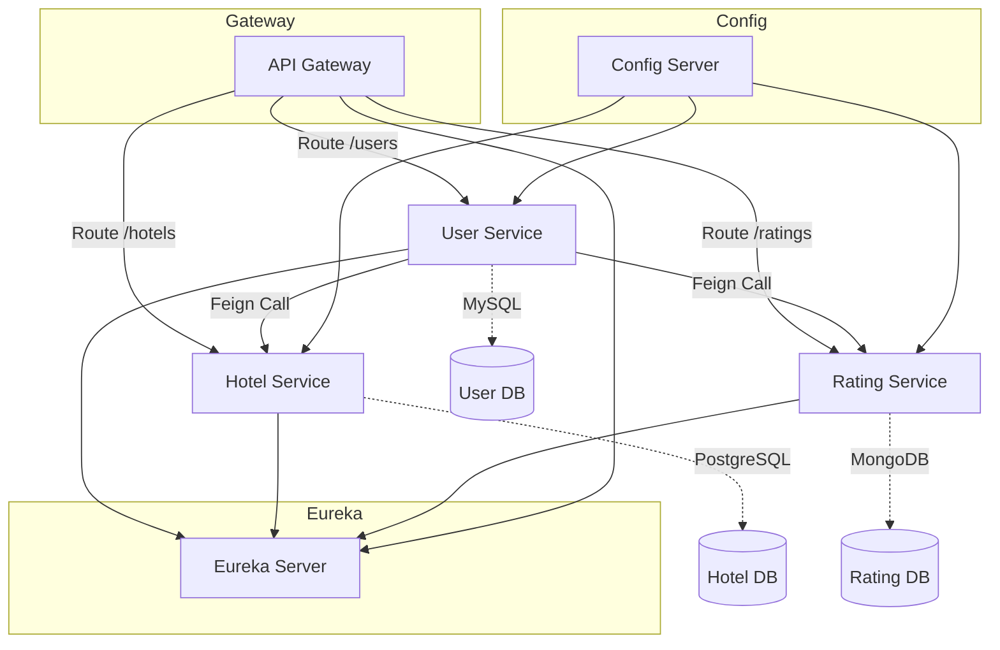

# 🌐 Hotel Review Microservices System

A full-fledged **microservices-based hotel review platform** built with **Spring Boot**, leveraging:

* **Eureka Service Discovery**
* **Spring Cloud Gateway**
* **Resilience4j** (Circuit Breaker, Retry, Rate Limiting)
* **Feign Clients** for inter-service communication
* Multiple databases: **MySQL**, **PostgreSQL**, and **MongoDB**

---

## ✨ Features

* **User Service** (MySQL): Handles user registration and related operations
* **Hotel Service** (PostgreSQL): Manages hotel details
* **Rating Service** (MongoDB): Stores and retrieves hotel ratings by users
* **API Gateway**: Central routing layer with resilience features
* **Eureka Server**: Service registry and discovery
* **Feign Clients**: Simplify REST communication across services
* **Resilience4j**: Implements Circuit Breaker, Rate Limiting, and Retry mechanisms for fault tolerance

---

## 🏗️ System Architecture

---

## 📁 Project Modules

### 1. UserService

* CRUD operations on users
* Communicates with `RatingService` and `HotelService` using **FeignClients**
* Persists data in **MySQL**
* Uses **@RateLimiter**, **@Retry**, and **@CircuitBreaker** for fault tolerance

### 2. HotelService

* CRUD operations for hotel data
* Stores information in **PostgreSQL**
* Implements centralized exception handling using `GlobalExceptionHandler`

### 3. RatingService

* Records and fetches ratings for hotels
* Built on **MongoDB**

### 4. ApiGateway

* Built using **Spring Cloud Gateway (WebFlux)**
* Dynamically routes traffic to downstream services
* Applies **Circuit Breakers** and **fallback methods** with Resilience4j

### 5. ServiceRegistry (Eureka)

* Provides discovery and load balancing of microservices

### 6. ConfigServer

* Centralized externalized configuration management
* Fetches configs from a remote Git repository at runtime

---

## ⚒️ Tech Stack

* **Java 17**
* **Spring Boot 3.4.6**
* **Spring Cloud 2024.0.1**
* **Spring Cloud Gateway**
* **Spring Data JPA & MongoDB**
* **Eureka Server**
* **Resilience4j**
* **Feign Clients**
* **Maven**

---

## 🚀 How to Run Locally

1. **Start Eureka Server**
2. **Start Config Server** (Ensure `microservice-config` Git repo is accessible)
3. **Start RatingService, HotelService, and UserService**
4. **Launch API Gateway**

✅ Ensure that **MySQL**, **PostgreSQL**, and **MongoDB** instances are running and schema is pre-configured.

---

## 🔗 Sample API Endpoints

| Service        | Example Endpoint                         |
| -------------- | ---------------------------------------- |
| User Service   | `/users/{userId}`                        |
| Hotel Service  | `/hotels/{hotelId}`                      |
| Rating Service | `/ratings/users/{userId}`                |
| API Gateway    | `/users/**`, `/hotels/**`, `/ratings/**` |

